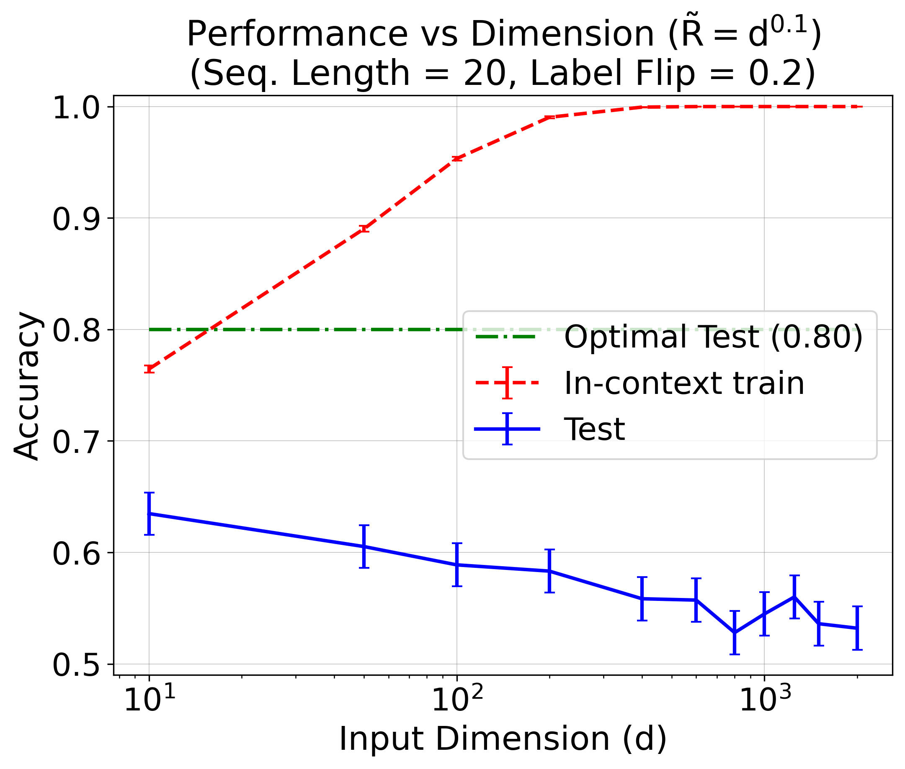
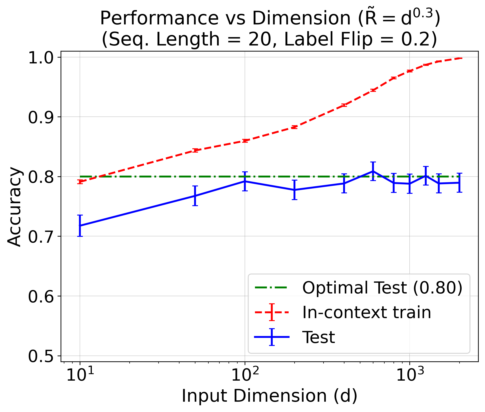
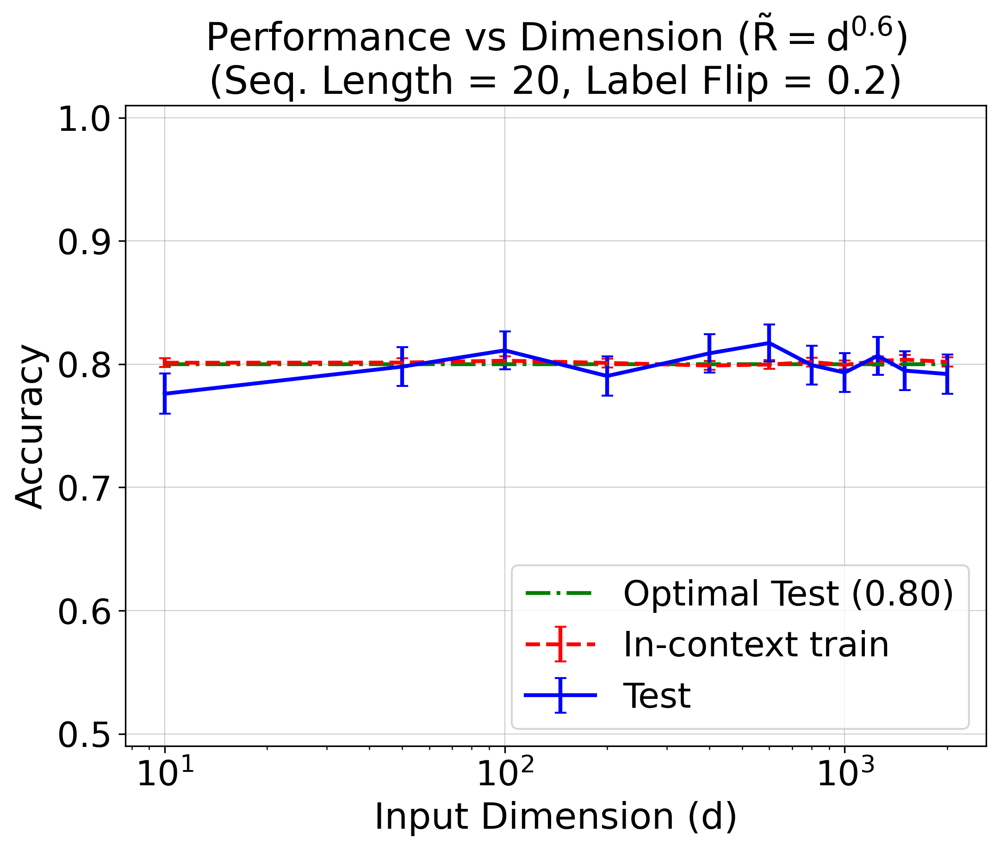
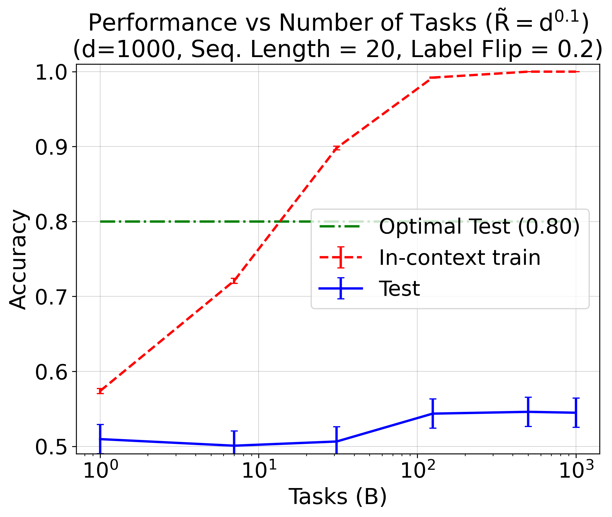
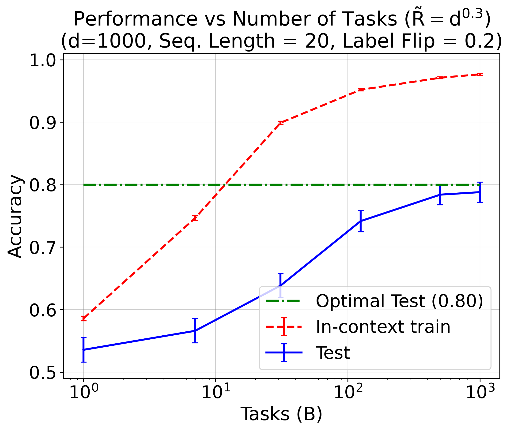
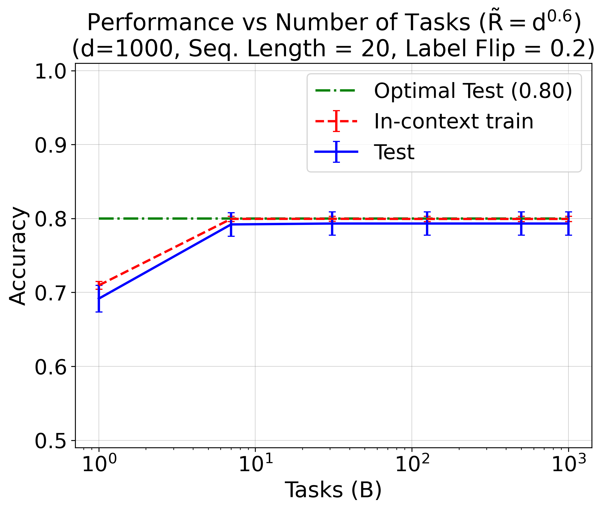

# Linear Transformer In-Context Learning

This repository implements the experiments from "Trained Transformer Classifiers Generalize and Exhibit Benign Overfitting In-Context" (Frei & Vardi, 2024). The paper analyzes how linear transformers trained on random linear classification tasks can learn supervised learning algorithms through in-context learning, and exhibit benign overfitting in their forward pass.

## Results

### Performance vs Input Dimension (d)
<div style="display: flex; justify-content: space-between;">
    
    
    
</div>

### Performance vs Number of Tasks (B)
<div style="display: flex; justify-content: space-between;">
    
    
    
</div>

Each plot shows:
- In-context training accuracy (red dashed line)
- Test accuracy (blue solid line) 
- Optimal accuracy (green dash-dot line)

When $\tilde R = d^{0.3}$, we see benign overfitting in-context when the embedding dimension $d$ is sufficiently large relative to the number of in-context examples: 100% training accuracy and near-optimal test accuracy.  (The first row has number of tasks $B=d$.)

## Setup

Create and activate conda environment:
```bash
conda create -n icl_classification python=3.11
conda activate icl_classification
```

Install requirements:
```bash
python -m pip install -r requirements.txt
```

## Running the Code

1. First, run the test suite to verify implementation:
```bash
python -m pytest test.py -v
```

All tests should pass.

2. Train models across different dimensions and batch sizes:
```bash
python classification_icl.py
```
This will save model checkpoints to the `checkpoints/` directory, using CUDA by default otherwise using multicore CPU.  Expect <= 1 hour compute time for GPU, <= 3 hours for CPU depending on your devices (I used RTX 3500 Ada).

3. Generate evaluation plots:
```bash
python eval_checkpoints.py
```
This will create the performance curves shown above in the `plots/` directory.

## Implementation Details

The codebase consists of three main components:

- `classification_icl.py`: Main implementation including:
  - `GaussianMixtureDataset`: Generates synthetic classification data
  - `LinearTransformer`: Single-layer linear transformer model
  - `Trainer`: Handles training loop and metrics tracking

- `test_classification_icl.py`: Comprehensive test suite covering:
  - Dataset generation and properties
  - Model architecture
  - Training dynamics
  - Memorization behavior

- `eval_checkpoints.py`: Evaluation utilities including:
  - Loading and analyzing model checkpoints
  - Computing performance metrics
  - Generating plots

Key features:
- Full-batch gradient descent training
- Simple linear layer $W \in R^{d\times d}$ architecture
- Gaussian mixture data generation with configurable signal-to-noise ratio R
- Label noise support via flipping probability p
- Tracking of in-context memorization and generalization metrics

## Citation

If you use find this helpful:
```
@article{frei2024trained,
      title={Trained Transformer Classifiers Generalize and Exhibit Benign Overfitting In-Context}, 
      author={Spencer Frei and Gal Vardi},
      year={2024},
      journal={Preprint, arXiv:2410.01774},
}
```